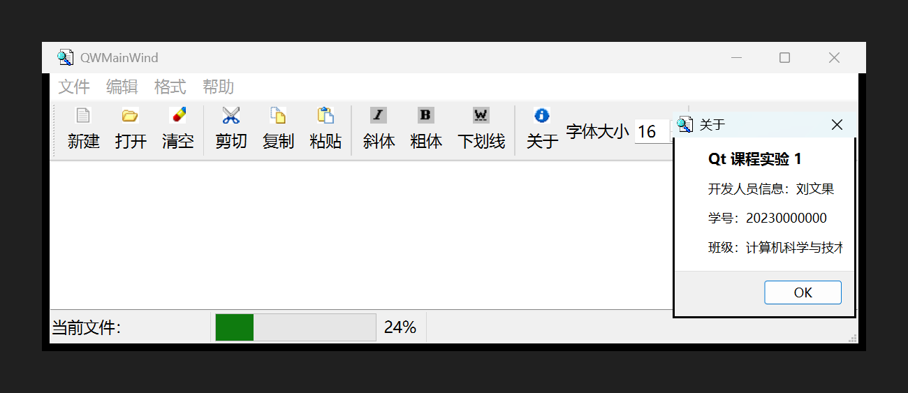

# 实验1 提交说明

## 一、任务1：给示例代码增加"关于"工具按钮

### 1. 任务要求
在示例代码 `samp2_4App` 中增加一个工具按钮，点击时弹出一个 About 窗口，输出姓名、学号等信息。

### 2. 完成情况

已在 `samp2_4App` 工程中新增"关于"工具按钮，点击后弹出 About 窗口，显示姓名、学号、班级和开发工具版本。



截图位置：`实验1/截图_任务1_关于窗口.png`

### 3. 代码改动清单

| 文件 | 改动说明 |
| --- | --- |
| `samp2_4App/images/about.bmp` | **新增**：16×16 的"关于"按钮图标（与工程原有 BMP 图标风格一致） |
| `samp2_4App/res.qrc` | 注册新图标：`<file>images/about.bmp</file>` |
| `samp2_4App/qwmainwind.ui` | **新增 Action `actAbout`**（图标 + 文本"关于" + 提示文字）；加入工具栏 `mainToolBar`；`menuRole` 设为 `NoRole`，避免 Qt 把它挪到系统菜单里 |
| `samp2_4App/qwmainwind.h` | 声明槽函数：`void on_actAbout_triggered();` |
| `samp2_4App/qwmainwind.cpp` | 在 `iniUI()` 中往菜单栏添加"帮助"菜单；实现 `on_actAbout_triggered()` |

### 4. 关键代码

**① 作者信息集中定义**（`qwmainwind.cpp` 顶部，改这三行即可换成自己的信息）

```cpp
#define APP_AUTHOR_NAME     QStringLiteral("梁展榕")           // 姓名
#define APP_AUTHOR_ID       QStringLiteral("2023423330214")    // 学号
#define APP_AUTHOR_CLASS    QStringLiteral("24软卓1班")         // 班级
```

**② 菜单栏中加入"帮助"菜单**（`QWMainWind::iniUI()`）

```cpp
QMenu *helpMenu = menuBar()->addMenu(QStringLiteral("帮助"));
helpMenu->addAction(ui->actAbout);
```

**③ 槽函数：弹出 About 窗口**（`QWMainWind::on_actAbout_triggered()`）

```cpp
void QWMainWind::on_actAbout_triggered()
{
    QMessageBox::about(this, tr("关于"),
        QStringLiteral("开发人员信息：%1\n"
                       "学号：%2\n"
                       "班级：%3\n"
                       "开发工具：Qt %4")
            .arg(APP_AUTHOR_NAME)
            .arg(APP_AUTHOR_ID)
            .arg(APP_AUTHOR_CLASS)
            .arg(QStringLiteral(QT_VERSION_STR)));
}
```

> 说明：槽函数命名为 `on_actAbout_triggered()`，Qt 的 `connectSlotsByName` 会自动把
> `actAbout` 的 `triggered()` 信号连接到它，因此**不需要手写 connect**。

### 5. 编译运行方法（Qt Creator）

1. 用 Qt Creator 打开 `samp2_4App/samp2_4.pro`；
2. 选择构建套件（例如 `Desktop Qt 6.6.0 MinGW 64-bit`）；
3. 点击"构建 → 运行"（Ctrl+R）；
4. 点击工具栏最右侧的"关于"按钮即可看到 About 窗口。

### 6. 实验过程中踩到的两个坑（供参考）

1. **项目目录里残留的 `ui_qwmainwind.h` 会覆盖新界面**。
   这个文件是 uic 自动生成的中间文件，如果它留在源码目录里，编译器会优先包含它，
   导致 `.ui` 的修改"改了没效果"。解决办法：删除源码目录下的 `ui_qwmainwind.h`，
   让它只在构建目录中生成（`.gitignore` 已忽略该文件）。
2. **About 类 Action 的 `menuRole`**。
   Qt 默认会按 macOS 习惯把"关于"这类 Action 从自定义菜单里挪走，导致菜单栏上
   看不到它。把该 Action 的 `menuRole` 显式设为 `NoRole` 后即正常显示。

---

## 二、任务2：GitHub 建仓与本地仓库同步

### 1. 任务要求
注册 GitHub 账号，创建 `QtCourse` 仓库，并把 Qt 创建的本地仓库内容同步到 GitHub。

### 2. 本地仓库（已完成）

本地 Git 仓库已建立在 `实验1/` 目录（与 Qt Creator 建的工程目录同级），
并完成了两次提交：

```
675a20d 实验1：关于窗口填入真实姓名/学号/班级，更新运行截图
9e48034 实验1：为 samp2_4App 增加关于工具按钮，并初始化仓库
```

仓库内容：

```
实验1/
├── .gitignore                     # Qt 工程专用忽略规则
├── README.md                      # 仓库说明
├── 截图_任务1_关于窗口.png         # 任务1 运行截图
└── samp2_4App/                    # Qt 工程源码
```

`.gitignore` 已排除 `*.pro.user`、`Makefile`、`moc_*`、`ui_*`、`*.o`、`*.exe`、`build-*` 等
构建产物，只提交源码。

### 3. 同步到 GitHub（待执行）

GitHub 账号：**DGLZR**（本机 SSH 密钥已配置并可正常认证）

在 `实验1` 目录下执行：

```bash
# ① 在 GitHub 网页上新建一个名为 QtCourse 的公开空仓库（不要勾选 Add README）

# ② 关联远程仓库并推送
git remote add origin git@github.com:DGLZR/QtCourse.git
git branch -M main
git push -u origin main
```

推送成功后，`GitHub → DGLZR/QtCourse` 页面即可看到全部代码与截图。

**任务2 成功截图**：`实验1/截图_任务2_GitHub仓库.png`（推送后补拍）
