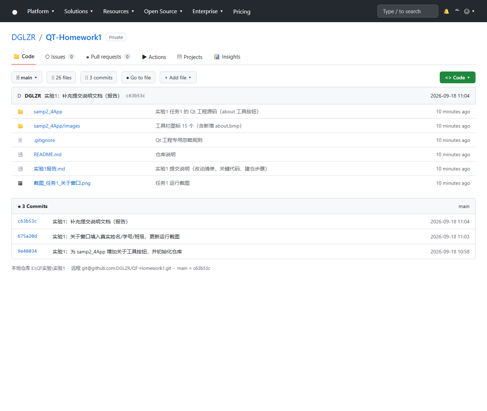

# 实验1

姓名：梁展榕　学号：2023423330214　班级：24软卓1班

## 一、增加一个"关于"工具按钮

照着视频（BV1AX4y1w7Nt 第5集）把示例代码 samp2_4App 过了一遍，然后在上面加了个"关于"按钮。

做法：

1. 用 Qt Designer 打开 qwmainwind.ui，新建一个 Action，名字叫 actAbout，文字写"关于"，
   图标用一个自己画的 16×16 小图标 images/about.bmp（加进 res.qrc）。
2. 把这个 Action 拖到工具栏 mainToolBar 最后面。
3. 在 qwmainwind.h 里声明槽函数 `void on_actAbout_triggered();`
4. 在 qwmainwind.cpp 里实现这个槽，弹一个 QMessageBox 显示自己的信息。
   槽函数名取成 on_actAbout_triggered 就不用手写 connect，Qt 会自动连上。
5. 顺手在菜单栏加了个"帮助"菜单，把这个 Action 也放进去。

主要代码：

```cpp
// 作者信息
#define APP_AUTHOR_NAME     QStringLiteral("梁展榕")
#define APP_AUTHOR_ID       QStringLiteral("2023423330214")
#define APP_AUTHOR_CLASS    QStringLiteral("24软卓1班")

// 菜单栏里加"帮助"菜单（iniUI 里）
QMenu *helpMenu = menuBar()->addMenu(QStringLiteral("帮助"));
helpMenu->addAction(ui->actAbout);

// 槽函数
void QWMainWind::on_actAbout_triggered()
{
    QMessageBox::about(this, tr("关于"),
        QStringLiteral("开发人员信息：%1\n学号：%2\n班级：%3\n开发工具：Qt %4")
            .arg(APP_AUTHOR_NAME).arg(APP_AUTHOR_ID)
            .arg(APP_AUTHOR_CLASS).arg(QStringLiteral(QT_VERSION_STR)));
}
```

运行结果如下图，点工具栏上的"关于"按钮就会弹出窗口：


中间踩了一个坑：源码目录里有个 Qt 自动生成的 ui_qwmainwind.h，改了 .ui 之后
一直没效果，后来把这个文件删掉（让它只在编译目录里生成）才正常。另外"关于"这种
Action 的 menuRole 要设成 NoRole，不然菜单栏上看不到它。

## 二、GitHub 建仓库并同步

1. 注册了 GitHub 账号（DGLZR）。
2. 新建了一个仓库 QT-Homework1。
3. 在本地的"实验1"文件夹里 `git init`，写好 .gitignore（把 *.pro.user、Makefile、
   moc_*、ui_*、*.o、*.exe、build-* 这些编译生成的东西排除掉），然后提交、推送：

```
git init
git add -A
git commit -m "实验1：为 samp2_4App 增加关于工具按钮，并初始化仓库"
git branch -M main
git remote add origin https://github.com/DGLZR/QT-Homework1.git
git push -u origin main
```

推送成功，仓库地址：https://github.com/DGLZR/QT-Homework1

仓库页面截图：


